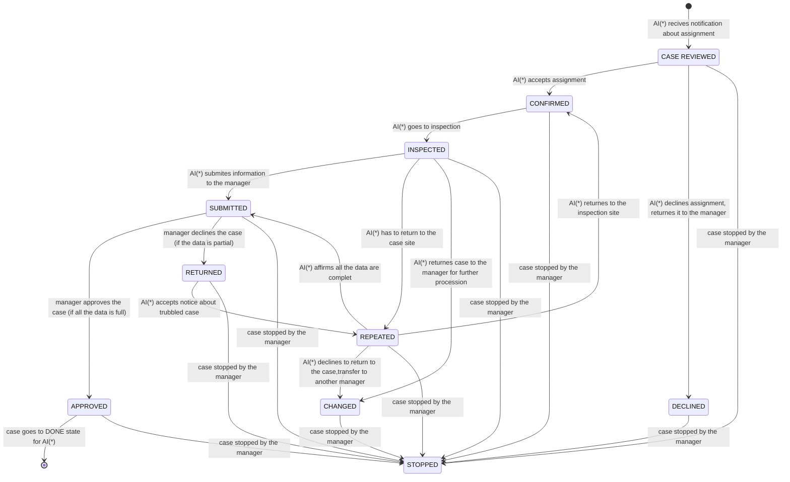

**states for inspector role**

```mermaid
stateDiagram-v2
    state "CASE REVIEWED" as reviewed
    state "CONFIRMED" as confirmed
    state "DECLINED" as declined
    state "INSPECTED" as inspected
    state "SUBMITTED" as submitted
    state "APPROVED" as approved
    state "RETURNED" as returned
    state "REPEATED" as repeated
    state "CHANGED" as changed
    state "STOPPED" as stopped
    
  
    
    [*] --> reviewed: AI(*) recives notification about assignment
    reviewed --> confirmed: AI(*) accepts assignment
    reviewed --> declined : AI(*) declines assignment, returnes it to the manager
    confirmed --> inspected: AI(*) goes to inspection
    inspected --> submitted: AI(*) submites information to the manager
    submitted --> approved: manager approves the case (if all the data is full)
    submitted --> returned: manager declines the case (if the data is partial)
    returned --> repeated: AI(*) accepts notice about trubbled case
    repeated --> changed: AI(*) declines to return to the case,transfer to another manager
    repeated --> confirmed: AI(*) returnes to the inspection site
    repeated --> submitted: AI(*) affirms all the data are complet
    inspected --> repeated: AI(*) has to return to the case site
    inspected --> changed: AI(*) returnes case to the manager for further procession
    approved --> [*]: case goes to DONE state for AI(*)
    reviewed --> stopped: case stopped by the manager
    confirmed --> stopped: case stopped by the manager
    declined --> stopped: case stopped by the manager
    inspected --> stopped: case stopped by the manager
    submitted --> stopped: case stopped by the manager
    approved --> stopped: case stopped by the manager
    returned --> stopped:case stopped by the manager
    repeated --> stopped: case stopped by the manager
    changed --> stopped:case stopped by the manager
    
```

AI(*) goes for asigned inspector 
